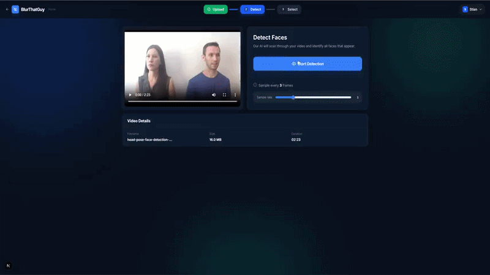
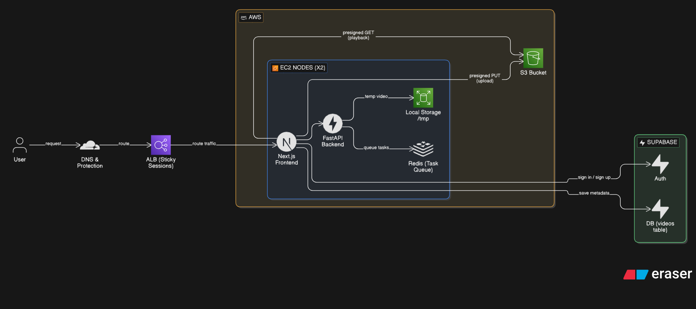

# BlurThatGuy


> A coding challenge submission for FONN Group and Mimir.
---
<p align="center">
  
</p>

---

## Preface

As part of this coding challenge, I wanted to specialize in **frontend** and **infrastructure** using React/Next.js and deploying AWS EC2.

---

## Learning Outcomes
- ***Cloud Architecture:*** Implemented a "shared-nothing" design where each node runs its own local Redis and storage. (To comply with the requirements)

- ***Full-Stack Integration:*** Connected a containerized Next.js frontend to a FastAPI backend.

- ***AWS Scaling:*** Scaled the app across multiple EC2 nodes to handle more users simultaneously.

- ***Traffic Management:*** Used an AWS Load Balancer with Sticky Sessions to keep user data synced to specific nodes.


---

## Table of Contents
- [Quick Start](#quick-start)
- [Environment Configuration](#environment-configuration)
- [How to Use](#how-to-use)
- [Tech Stack](#tech-stack)
- [Design Rationale](#design-rationale)
- [Backend Features](#backend-features)
- [Deployment](#deployment)
- [User Integration](#user-integration)
- [Architecture Diagram](#architecture-diagram)
- [CI/CD Pipeline](#cicd-pipeline)
- [Project Structure](#project-structure)
- [Docker Tips](#docker-tips)
- [Troubleshooting](#troubleshooting)

---

## Quick Start

### Option 1: Live Demo  _(with user integration)_

**Requirements:** Web browser (contact me to start the EC2 instance)

[https://blurthatguy.no/](https://blurthatguy.no/)

---

### Option 2: Run with Docker _(without user integration)_

**Requirements:** [Docker Desktop](https://www.docker.com/products/docker-desktop/) (includes Docker Compose)

```bash
# Clone the repository
git clone https://github.com/StianHa02/BlurThatGuyProject.git
cd BlurThatGuyProject
```

> **Recommended:** For better ReID accuracy, download the full `w600k_r50.onnx` model from HuggingFace and place it in `backend/models/`:
> [https://huggingface.co/maze/faceX/blob/main/w600k_r50.onnx](https://huggingface.co/maze/faceX/blob/main/w600k_r50.onnx)

```bash
# Start everything 
docker compose up --build

# Stop
docker compose down
```

**For Development (hot reload):**
```bash
docker compose -f docker-compose.dev.yml up --build

# In a second terminal
pnpm run dev
```

Open [http://localhost:3000](http://localhost:3000)

---

### Option 3: Run Locally

**Requirements:** Node.js 20+, Python 3.11+, pnpm (`npm install -g pnpm`)

**Terminal 1 — Backend (macOS/Linux):**
```bash
cd backend
python -m venv venv
source venv/bin/activate
pip install -r requirements.txt
uvicorn main:app --host 0.0.0.0 --port 8000 --reload
```

**Terminal 1 — Backend (PowerShell):**
```powershell
cd backend
python -m venv venv
.\venv\Scripts\Activate.ps1
pip install -r requirements.txt
uvicorn main:app --host 0.0.0.0 --port 8000 --reload
```

**Terminal 2 — Frontend:**
```bash
pnpm install
pnpm dev
```

Open [http://localhost:3000](http://localhost:3000)

> **Note:** Local development runs in `DEV_MODE`, which disables API key authentication.

---

## Environment Configuration

### Local Development

**Frontend** (`.env.local` in project root):
```bash
API_URL=http://localhost:8000
API_KEY=""
```

**Backend** (`backend/.env.local`):
```bash
DEV_MODE=true
ALLOWED_ORIGINS=http://localhost:3000
REDIS_URL=redis://localhost:6379

#Optional: API key for production testing. Can be left blank in development.
#API_KEY=""

# Optional: limit upload size in MB. Omit for no limit.
# MAX_UPLOAD_SIZE_MB=500

# Optional: override ONNX thread budget. Omit to auto-detect from cpu_count().
# TOTAL_THREAD_BUDGET=28
```

### Production Deployment

> **Note:** Remove the environment section in docker-compose.yml for production and point environment variables to the .env files.


**Frontend** (`.env.prod`):

```bash
API_URL=http://backend:8000
API_KEY=your-secure-random-api-key-here
BACKEND_URL=http://backend:8000
```

**Backend** (`.env.prod`):
```bash
API_KEY=same-api-key-as-frontend
ALLOWED_ORIGINS=https://your-domain.com
REDIS_URL=redis://redis:6379

# Optional: limit upload size in MB. Omit for no limit.
# MAX_UPLOAD_SIZE_MB=500

# Optional: set explicitly on high-core-count servers for best performance.
# TOTAL_THREAD_BUDGET=28
```

---


## How to Use

1. **Upload Video:**  drag & drop or click to upload. Supported: MP4, WebM, MOV.

2. **Detect Faces:**  click Start Detection. The AI scans through your video, detects all faces, tracks them across frames, and re-identifies the same person across scene cuts. A 15-minute video at the default sample rate takes roughly 2 minutes to process.

3. **Select Faces to Blur:**  play the video and click faces with red frames, or select from the face gallery. Selected faces appear pixelated in real time.

4. **Download:**  click Download Video. The processed file is encoded with selected faces permanently blurred.

---

## Tech Stack

**Frontend:** Next.js (App Router), React, TypeScript, Tailwind CSS, Framer Motion, Lucide React <br/>
**Backend:** Python, FastAPI, Uvicorn, OpenCV, NumPy, ONNX Runtime, Redis (via redis-py)<br/>
**Infrastructure:** Docker + Docker Compose, AWS EC2 , nginx (reverse proxy), GitHub Actions (CI/CD)

---

## Design Rationale

This system uses a shared-nothing architecture with sticky sessions.

This choice was intentional due to the challenge constraints:
- The system must run locally without external services
- It must be portable across environments
- It should scale across multiple machines if needed

By keeping each node self-contained (local Redis + storage), the system:
- Remains fully offline-compatible
- Avoids external dependencies
- Supports horizontal scaling by simply adding more nodes

Tradeoff:
- Node-local state means jobs are not fault-tolerant across node failures
- The load balancer cannot see per-node queue lengths, so it cannot route users to the node with the shortest queue

In a production cloud system, this would likely be replaced with:
- Shared object storage (e.g., AWS S3 bucket)
- Stateless workers
- Centralized queue in a shared cache (e.g., AWS ElastiCache)
---

## Backend Features

### Face Detection
Uses **SCRFD-2.5G** (`scrfd_2.5g.onnx`), A lightweight ONNX model optimised for CPU. Runs inference on sampled frames at a configurable rate (default: every 3rd frame). Detects 5 facial keypoints per crop. Frames are decoded via ffmpeg for speed, with an OpenCV fallback.

### Face Tracking
Builds continuous face tracks across frames using IoU-based assignment with a fallback to normalised centre-distance and appearance similarity for occluded or briefly-missing faces.

**MAD Scene Cut Detection**
Each sampled frame is downscaled to a 64×36 thumbnail and converted to grayscale. The mean absolute difference (MAD) between consecutive thumbnails is computed. If the MAD exceeds a threshold (45.0) and at least 8 sampled frames have passed since the last detected cut, the frame is recorded as a scene boundary. These cut frames are handed to the tracker, which blocks IoU assignment across a cut boundary (`cut_mask`). Without this gate, a face visible in the last frame of one scene could be incorrectly linked to a similar-looking face in the opening frame of the next scene, causing identity bleed and wrong blurs.

### Re-Identification (ReID)
Uses **ArcFace** (`w600k_r50.onnx` preferred, `w600k_mbf.onnx` as fallback) to generate 512-dimensional L2-normalised identity vectors per face crop. Merges fragmented tracks across scene cuts by cosine similarity with a union-find algorithm. Includes quality gates: blur rejection (Laplacian variance), profile angle rejection (landmark geometry), and an incremental drift-aware centroid that rejects embeddings inconsistent with the track's running identity.

### Job Queue
Built on **Redis** with a 2-concurrent-job limit. A third user uploading while two jobs are running is placed in a FIFO waiting queue and shown their position in the UI. When a slot frees, either naturally on completion or immediately on cancel, the next waiter is promoted and begins processing. Thread budget is split evenly across active jobs so two concurrent users each get half the available CPU rather than competing.

### Export & Blur Rendering
Pixelation (or blackout) applied exclusively to selected track IDs. Rendered via ffmpeg with hardware encoder detection (nvenc → amf → videotoolbox → qsv → libx264 fallback). Export progress streamed back to the client as NDJSON.

### API & Streaming
Built with **FastAPI + Uvicorn**. Detection results stream as NDJSON for real-time progress. All endpoints are proxied through Next.js route handlers in `app/api/*`. Relevant endpoints:

| Endpoint | Method | Description |
|---|---|---|
| `/upload-video` | POST | Upload a video file |
| `/detect-video/{videoId}` | POST | Start detection (streams NDJSON or returns 202 if queued) |
| `/job/{jobId}/status` | GET | Poll job status, position, and progress |
| `/job/{jobId}/result` | GET | Fetch completed detection results |
| `/job/{jobId}/cancel` | POST | Cancel a queued or running job |
| `/export/{videoId}` | POST | Render blurred video (streams NDJSON progress) |
| `/download/{videoId}` | GET | Download the blurred output file |

---

## Deployment

The production environment is architected for high-performance video processing and both vertical and horizontal scalability, utilizing a multi-node AWS EC2 footprint.

### Infrastructure Overview
The application runs on two independent EC2 instances situated behind an **Application Load Balancer (ALB)**:

| Node | Instance Type | Role | Key Specifications |
| :--- | :--- | :--- | :--- |
| **Primary** | `c7i` | Primary Compute | High vCPU count, Intel Sapphire Rapids |
| **Secondary** | `c7i` | Burst Overflow | Lower vCPU count, cost-optimized |

### Traffic Orchestration
* **Routing Algorithm:** The ALB utilizes the **Least Outstanding Requests** algorithm. This ensures that new jobs are automatically sent to the node with the lowest active workload. Due to the high core count of the Primary node, it naturally absorbs the majority of traffic by completing jobs faster.
* **Session Persistence (Sticky Sessions):** To maintain the integrity of local state, **Sticky Sessions** are enabled at the ALB level. This ensures that once a user starts an upload, all subsequent requests for detection and blurring are pinned to the specific node holding their local video files and Redis task state.

### Scalability & Architecture
* **Shared-Nothing Design:** Each node operates as a self-contained "island" with its own local Redis instance and dedicated storage. This architectural choice ensures that there is no centralized database bottleneck or network storage latency.
* **Linear Scaling:** Because nodes are independent, the system supports near-linear horizontal scaling. Doubling capacity is as simple as launching a new EC2 instance and adding it to the ALB target group with zero code changes required.
* **CI/CD Pipeline:** Automated deployments are managed via **GitHub Actions**. The pipeline performs health checks on the frontend and backend containers before using SSH to remotely deploy the application.

---

## User Integration

Optional feature. Controlled by `NEXT_PUBLIC_USER_INTEGRATION`. Set to `1` to enable accounts and project storage. Set to `0` or omit to run as a public tool with no sign-up.

Full setup: [`docs/user-integration.md`](docs/user-integration.md)

### What It Adds

| Feature | Description |
|---|---|
| Accounts | Sign up, log in, manage profile via navbar dropdown |
| Projects | Save original video + face tracks to S3 for re-editing later |
| Re-edit | Re-open a saved project, pick different faces, download a new export without re-running detection |

Powered by Supabase (auth + database) and AWS S3 (file storage).

### Save Flow

**Save Project** uploads the original unblurred video and face tracks to S3, then stores metadata in Supabase. No blurred output is stored. It is always generated on demand.

1. `POST /api/projects/presign` returns a signed S3 PUT URL (auth + quota checks)
2. Browser uploads the original video directly to S3
3. `POST /api/projects/presign-tracks` returns a signed URL for the tracks JSON
4. Browser uploads the tracks JSON directly to S3
5. `POST /api/projects/save` writes both S3 keys + metadata to Supabase

### Re-edit Flow

1. `POST /api/projects/{id}/restore` generates signed URLs, re-uploads the original to the backend, returns a new `videoId` + tracks URL
2. Browser fetches the tracks JSON from S3
3. Browser navigates to `/upload?projectId=xxx`, landing on the face-select step with all tracks loaded
4. User picks faces, exports, and downloads as usual

### Storage

Private S3 bucket. All files scoped to the authenticated user.

| Type | Key pattern |
|---|---|
| Original video | `projects/{userId}/{uuid}-{filename}` |
| Face tracks | `projects/{userId}/{uuid}-tracks.json` |

**Limits:** 2 GB per file, 5 GB per user, 30 GB bucket cap, 10 saves/user/hour.

### Security

| Threat | Mitigation |
|---|---|
| Cross-user file access | Private bucket, owner-scoped signed URLs |
| Upload path spoofing | Signed PUT URLs generated server-side using the authenticated user's ID |
| SSRF on re-edit | Backend only accepts downloads from `*.amazonaws.com` hosts |
| Spam / abuse | Rate-limited to 10 saves per user per hour |
| Storage abuse | Per-user quota + bucket cap |
| Oversized files | Size checked before issuing upload URL |

---

## Architecture Diagram



---

## CI/CD Pipeline

Every push and pull request triggers a GitHub Actions workflow (`.github/workflows/ci.yml`)

| Job | What it does |
|---|---|
| **Frontend Lint** | Runs ESLint with zero-warning policy |
| **Frontend Tests** | Runs Vitest unit tests (format utils, API client) |
| **Backend Tests** | Runs pytest suite (config validation, storage, tracker, API endpoints) |
| **Backend Health** | Starts the backend with Redis and verifies `/health` responds |
| **Frontend Health** | Spins up both backend + frontend and verifies the Next.js API proxy (`/api/health`) works end-to-end |
| **Build Smoke** | Runs `next build` production build + backend import check |

The pipeline uses `concurrency` groups to cancel in-progress runs on the same branch, keeping CI fast. Redis is provided as a service container for jobs that need it.

```
Push / PR
  ├── ESLint ──────────────────────► ✓
  │     ├── Frontend Tests ────────► ✓
  │     ├── Frontend Health ───────► ✓
  │     └── Build Smoke ───────────► ✓
  ├── Backend Tests ───────────────► ✓
  └── Backend Health ──────────────► ✓
```

For production deployment, the live environment runs on **AWS EC2** behind an Application Load Balancer. Deploys are triggered via GitHub Actions after CI passes, building Docker images and rolling them out to the target instances.

---

## Project Structure

```
BlurThatGuyProject/
├── app/
│   ├── layout.tsx                     # Root layout with font loading and metadata
│   ├── page.tsx                       # Redirects to the landing page
│   ├── globals.css                    # Tailwind base styles and custom utilities
│   │
│   ├── (landing)/                     # Landing page (route group, serves /)
│   │   ├── page.tsx                   # Hero, features, and demo sections
│   │   ├── components/
│   │   └── hooks/                     # Hook for syncing URL hash with scroll position
│   ├── upload/                        # Core blurring workflow (3-step single page)
│   │   ├── page.tsx                   # Upload → Detect → Select/Export wizard
│   │   └── hooks/
│   │       ├── useVideoUpload.ts      # File validation, upload to backend, metadata extraction
│   │       ├── useFaceDetection.ts    # Detection polling, queue status, track state
│   │       └── useVideoExport.ts      # Export progress streaming and download trigger
│   ├── login/page.tsx                 # Supabase email/password login
│   ├── signup/page.tsx                # Account creation with username
│   ├── settings/page.tsx              # Account management and deletion
│   ├── my-projects/page.tsx            # Saved projects grid with re-edit and delete
│   └── api/                           # Next.js Route Handlers (proxy to FastAPI)
│       ├── upload-video/
│       ├── detect-video/[videoId]/
│       ├── export/[videoId]/
│       ├── download/[videoId]/
│       ├── health/
│       ├── job/[jobId]/
│       │   ├── status/
│       │   ├── result/
│       │   └── cancel/
│       ├── projects/
│       │   ├── presign/               # Pre-signed S3 URL for original video upload
│       │   ├── presign-tracks/        # Pre-signed S3 URL for tracks JSON upload
│       │   ├── save/                  # Save project metadata to Supabase
│       │   ├── delete/                # Delete project (S3 + DB)
│       │   └── [id]/restore/          # Re-upload original to backend for re-editing
│       └── user/delete/
├── components/                        # Shared UI components (used across routes)
├── types/                             # Shared TypeScript types
├── lib/
│   ├── config.ts                      # NEXT_PUBLIC_* env vars and feature flags
│   ├── server/                        # Server-side utilities
│   │   ├── auth.ts                    # API authentication and session checks
│   │   ├── backendProxy.ts            # Builds proxied fetch requests with API key
│   │   ├── s3.ts                      # AWS S3 integration for project files
│   │   └── validation.ts              # Validation logic for server routes
│   ├── services/                      # Client-side API wrappers
│   │   ├── faceClient.ts              # Functions for upload, detect, export, and job polling
│   │   └── __tests__/                 # Vitest tests for the API client
│   ├── supabase/                      # Supabase integration layers
│   │   ├── admin.ts                   # Service-role client for admin operations
│   │   ├── client.ts                  # Browser Supabase client
│   │   └── server.ts                  # Server-side Supabase client (cookies)
│   └── utils/                         # Shared pure functions
│       ├── format.ts                  # formatFileSize, formatDuration, formatDate
│       ├── index.ts                   # Centralised exports
│       └── __tests__/                 # Tests for formatting utilities
├── backend/                           # Python FastAPI backend
│   ├── main.py                        # App entry point + all API endpoints
│   ├── config.py                      # Env vars, validation, temp file paths
│   ├── storage.py                     # In-memory tracks and job-result store
│   ├── pipeline/
│   │   ├── detector.py                # SCRFD face detection + ONNX session pool
│   │   ├── tracker.py                 # IoU-based frame-to-frame track building
│   │   ├── reid.py                    # ArcFace ReID + cross-scene identity merge
│   │   ├── blur.py                    # Pixelation and blackout rendering
│   │   └── processor.py              # Full detection pipeline orchestrator
│   ├── jobs/
│   │   ├── job_runner.py              # Async job execution with thread budget splitting
│   │   ├── queue_manager.py           # Redis-backed FIFO queue + admission control
│   │   └── stream_generators.py       # NDJSON generators for detect/export progress
│   ├── tests/
│   │   ├── test_config.py             # Config validation & path traversal tests
│   │   ├── test_storage.py            # In-memory store CRUD tests
│   │   ├── test_tracker.py            # IoU, geometry, tracking & interpolation tests
│   │   └── test_api.py                # API endpoint tests (FastAPI TestClient)
│   ├── models/                        # 
│   └── requirements.txt
├── docker-compose.yml                 # Local development setup
├── docker-compose.dev.yml             # Development with hot reload (backend + redis only)
├── docker-compose.prod.yml            # Production deployment (uses .env.prod)
├── Dockerfile.backend
├── Dockerfile.frontend
└── .github/workflows/
    ├── ci.yml                         # Lint, tests, health checks, build on PR
    └── cd.yml                         # Deploy to EC2 on push to main
```

---

## Docker Tips

```bash
# View logs
docker compose logs -f
docker compose logs -f backend

# Rebuild after changes
docker compose down && docker compose up --build

# Clean rebuild
docker compose down
docker system prune -a
docker compose up --build

# Check running containers
docker compose ps
```
---

## Troubleshooting

**No faces detected**
- Ensure faces are clearly visible and reasonably frontal
- Lower the sample rate slider (lower = more thorough)

**Detection is slow**
- Increase the sample rate (higher = faster, less thorough)
- Check that the backend container has access to all CPU cores

**Containers won't start**
```bash
docker compose down
docker system prune -a
docker compose up --build
```

**Port already in use (macOS/Linux)**
```bash
lsof -ti:3000 | xargs kill -9
lsof -ti:8000 | xargs kill -9
```

**Port already in use (PowerShell)**
```powershell
Get-NetTCPConnection -LocalPort 3000 -ErrorAction SilentlyContinue | ForEach-Object { Stop-Process -Id $_.OwningProcess -Force }
Get-NetTCPConnection -LocalPort 8000 -ErrorAction SilentlyContinue | ForEach-Object { Stop-Process -Id $_.OwningProcess -Force }
```

---

## License

[MIT](LICENSE) — Made by [stianha.com](https://stianha.com)